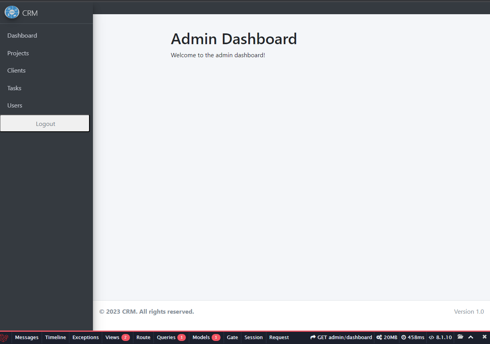

# Simple CRM System

This is a Simple CRM System project developed by HASSAN GOMAA HASSAN KHALED. It includes an admin panel system for managing Clients, Projects, and Tasks with CRUD operations. The system has several features, including:

## Features

- Validation for Client email and phone fields with required image upload during create and update.
- Unique project name validation during create and update.
- Routing using Route Model Binding in Resource Controllers.
- Homepage automatically redirects to the login form.
- Users and clients stored in different database tables.
- Database Seeders and Factories to automatically create initial clients, projects, tasks, and default users.
- Soft Deletes applied on any Eloquent models.
- Error handling with try-catch and Laravel Exceptions.
- Customized 404 error page.

## Technology Stack

This project was developed using the Laravel framework, which is a web application framework with expressive, elegant syntax. Laravel provides several features that make development easier and faster. Some of these features include a simple, fast routing engine, a powerful dependency injection container, multiple back-ends for session and cache storage, expressive, intuitive database ORM, database agnostic schema migrations, robust background job processing, and real-time event broadcasting.

## Installation and Usage

To install and use this project, follow these steps:

1. Clone the repository.
2. Install dependencies using `composer install`.
3. Create a `.env` file by copying the `.env.example` file and setting the necessary environment variables.
4. Run database migrations using `php artisan migrate`.
5. Seed the database with initial data using `php artisan db:seed`.
6. Start the server using `php artisan serve`.
7. Navigate to `http://localhost:8000` in your web browser to use the system.

## Contribution

Contributions to this project are welcome. To contribute, please follow the guidelines in the Laravel documentation for contributions.

## License

This project is open-sourced software licensed under the MIT license.

